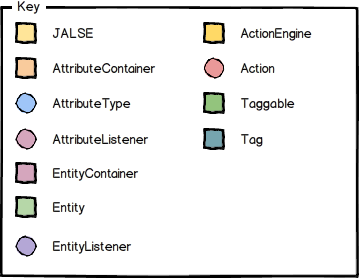
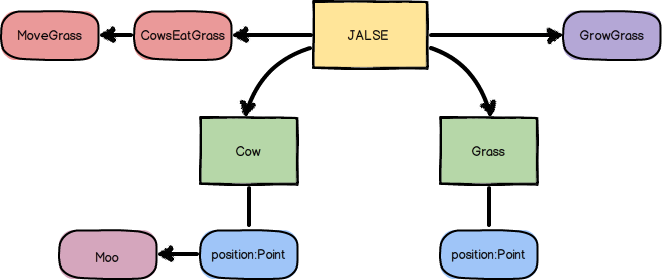

## HappyCows
HappyCows is a [JALSE](https://github.com/Ellzord/JALSE) example project. It is a small simulation of cows in a field that randomly move and eat grass (which grows back over time).

### Building and running with Gradle
1. Build using ```./gradlew build``` (see [Building Java Projects with Gradle](https://spring.io/guides/gs/gradle/#_build_your_project_with_gradle_wrapper))
2. Run using ```./gradle run``` (See [The Application Plugin](http://gradle.org/docs/current/userguide/application_plugin.html))

Optionally you can also create an **Eclipse** project using ```./gradlew eclipse``` (see [The Eclipse Plugins](http://gradle.org/docs/current/userguide/eclipse_plugin.html)).

### Simulation life-cycle
1. [Grass](https://github.com/Ellzord/JALSE-HappyCows/blob/master/src/main/java/happycows/entities/Grass.java) seeds are sown.
2. [Cow](https://github.com/Ellzord/JALSE-HappyCows/blob/master/src/main/java/happycows/entities/Cow.java)s are birthed.
3. An [Action](https://github.com/Ellzord/JALSE/blob/master/src/main/java/jalse/actions/Action.java) chain is built from [CowsEatGrass](https://github.com/Ellzord/JALSE-HappyCows/blob/master/src/main/java/happycows/actions/CowsEatGrass.java) and  [MoveCows](https://github.com/Ellzord/JALSE-HappyCows/blob/master/src/main/java/happycows/actions/MoveCows.java) causing the cows to eat any grass at their current position and then move (much as cows do in real life).
4. Eating Grass causes [GrowGrass](https://github.com/Ellzord/JALSE-HappyCows/blob/master/src/main/java/happycows/entities/GrowGrass.java) to fire sowing another seed.
5. Repeat from 3.

### Model key


### Model


### Output
see [output.txt](output.txt)!

### More
See the [Wiki](https://github.com/Ellzord/JALSE/wiki) for more information.
